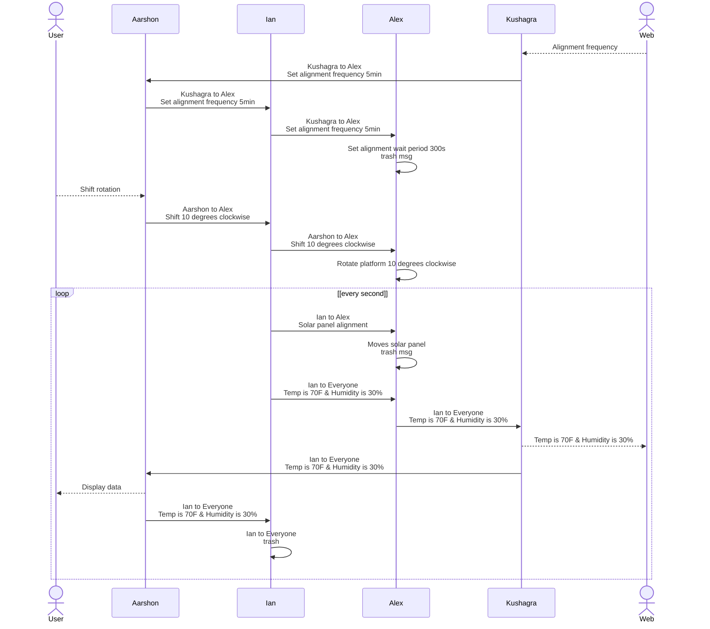

## Block Diagram

## Process Diagram

## Message Structure

Message type byte 1-2 uint16_t | Description
---|---
1 | print sensor data A B C D
2 | *more data msgs*
3 | subsystem Z status code

**Message Type 1:** Sensor Data Transmission

byte 1-2 | byte 3 | byte 4 | byte 5 | byte 6
---|---|---|---|---
0x01 | A(uint8_t) | B(uint8_t) | C(uint8_t) | D(uint8_t)
**sensor** | wind speed | temperature | humidity | atm pressure

**Message Type 2:**

byte 1-2 | byte 3
---|---
0x02 | (uint8_t)

**Message Type 3:** Subsystem Status Code

byte 1-2 | byte 3 | byte 4
---|---|---
0x03 | Z(uint_8) | (uint8_t)

code number | meaning
---|---
0 | full funtionality
1 | partial funtionality
2 | no funtionality
