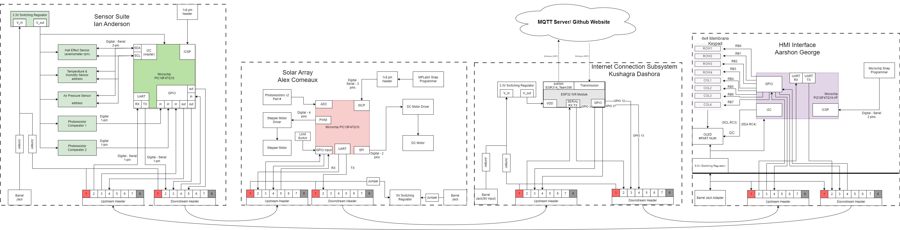
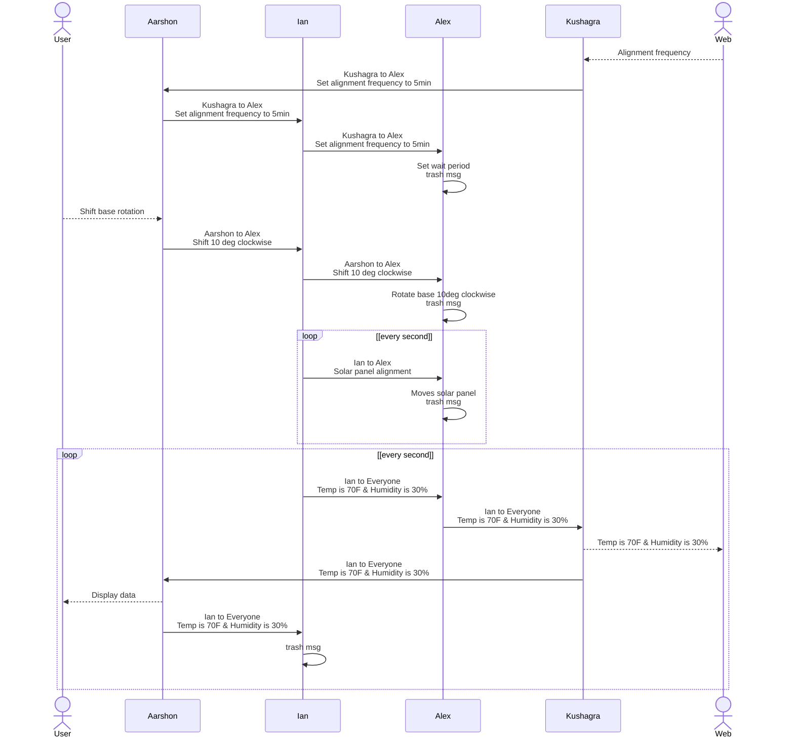

## Block Diagram

## Process Diagram

## Message Structure

Message type byte 1-2 uint16_t | Description
---|---
1 | print sensor data A B C D
2 | move motor X param Y
3 | set period X
4 | subsystem Z status code
5 | subsystem Z error msg

**Message Type 1:** Sensor Data Transmission

byte 1-2 | byte 3 | byte 4 | byte 5 | byte 6
---|---|---|---|---
0x01 | A(uint8_t) | B(uint8_t) | C(uint8_t) | D(uint8_t)
| | wind speed | temperature | humidity | atm pressure

**Message Type 2:** Shift Motor

byte 1-2 | byte 3 | byte 4
---|---|---
0x02 | X(uint8_t) | Y(uint8_t)
| | motor # | theta

**Message Type 3:** Alignment frequency

byte 1-2 | byte 3-4
---|---
0x03 | X(uint16_t)
| | time(sec)

**Message Type 4:** Subsystem Status Code

byte 1-2 | byte 3 | byte 4
---|---|---
0x04 | Z(uint_8) | (uint8_t)
| | subsystem # | code

code number | meaning
---|---
0 | full funtionality
1 | partial funtionality
2 | no funtionality

**Message Type 5:** Subsystem Error Message

byte 1-2 | byte 3-58
---|---
0x05 | char(uint8_t)
