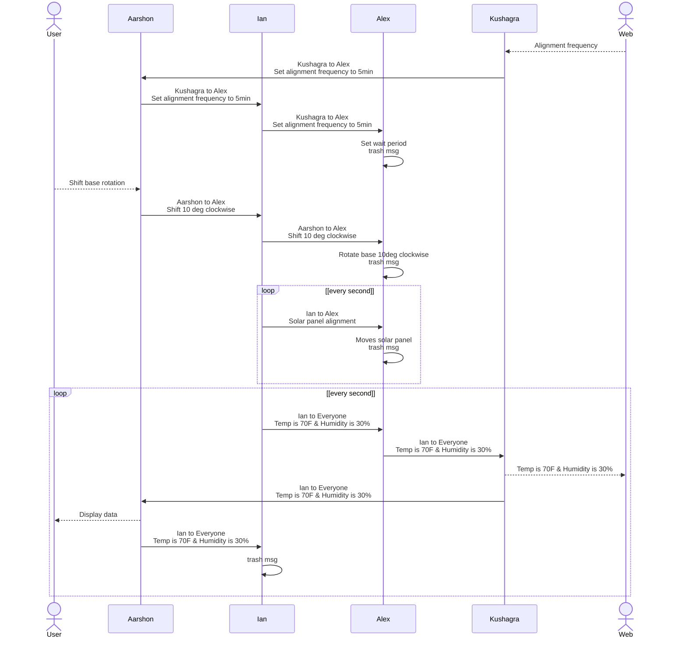

## Block Diagram

The station is comprised of four subsystems which are each assigned to a group member. These subsystems are connected through a UART daisy chain that functions as a continuous loop for messages. This daisy chain is also used to transfer power, ground, and other signals between neighboring subsystems.

Daisy Chain Header Pin Assignment  

1. External Power (+9-12V)
2. UART Transmit Line (TX/RX)
3. UART Ready to Send
4. UART Clear to Send
5. Subsystem Specific/No Connection
6. Subsystem Specific/No Connection
7. Subsystem Specific/No Connection
8. External Ground

## Process Diagram

All critical information is sent through UART and must follow the protocol below. Messages that are sent to everyone in the chain are trashed by the sender. Messages with a designated recipient are trashed by the recipient. Messages may be single commands or continuous loops.

## Message Structure

Message type byte 2 (uint8_t) | Description
---|---
1 | print sensor data A B C D
2 | move motor X param Y
3 | set period X
4 | subsystem Z status code
5 | subsystem Z error msg
6 | print local weather X data Y

**Message Type 1:** Sensor Data Transmission  
Message type for sending measured wind speed, temperature, humidity, and air pressure to all other subsystems.

byte 1 | byte 2-3 | byte 4-5 | byte 6-7 | byte 8-9
---|---|---|---|---
0x01 | A(uint16_t) | B(uint16_t) | C(uint16_t) | D(uint16_t)
~ | wind speed | temperature | humidity | atm pressure

**Message Type 2:** Shift Motor  
Message type for sending a command to rotate base stepper "Y" degrees.

byte 1 | byte 2 | byte 3
---|---|---
0x02 | X(uint8_t) | Y(uint8_t)
~ | motor # | theta

**Message Type 3:** Alignment frequency  
Message type for sending a command to set the panel alignment frequency "X" number of seconds.

byte 1 | byte 2-3
---|---
0x03 | X(uint16_t)
~ | time(sec)

**Message Type 4:** Subsystem Status Code  
Message type for sending status code of subsystem "Z" to be displayed.

byte 1 | byte 2 | byte 3
---|---|---
0x04 | Z(uint8_t) | (uint8_t)
~ | subsystem # | code

code number | meaning
---|---
0 | full funtionality
1 | partial funtionality
2 | no funtionality

**Message Type 5:** Subsystem Error Message  
Message type for sending string about subsystem error.

byte 1 | byte 2-58
---|---
0x05 | Error Message char(uint8_t)

**Message Type 6:** Local Weather Data  
Message type for sending received local weather data for HMI display

Byte 1 | Byte 2 | Byte 3-4
---|---|---
0x06 | X(uint8_t) | Y(uint16_t)
~ | data type | data value
