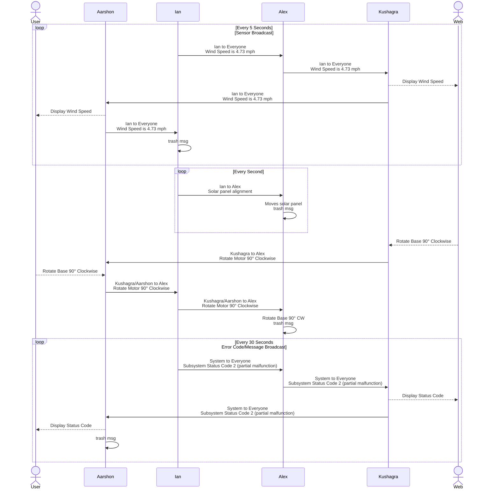

## Block Diagram

The station is comprised of four subsystems which are each assigned to a group member. These subsystems are connected through a UART daisy chain that functions as a continuous loop for messages. This daisy chain is also used to transfer power, ground, and other signals between neighboring subsystems.

The MacroChip Weather Station is organized into four interconnected subsystems, each handled by a different team member: the HMI Module, Sensor Suite, Solar Actuator, and Internet Communication module. These subsystems are linked in a daisy-chain bus topology.

Physically, each custom PCB has an upstream and downstream 8-pin header that passes power and communication signals to the next board in line.

The chain is powered from a single external supply (9V DC input), which is regulated on each board to the required voltage (5V or 3.3V depending on components). This simplifies wiring – we can power all modules from one source – and ensures that every board can easily connect in series during demonstrations.

**Daisy Chain Header Pin Assignment**  

1. External Power (+9-12V)
2. UART Transmit Line (TX/RX)
3. UART Ready to Send (inactive)
4. UART Clear to Send (inactive)
5. Subsystem Specific/No Connection
6. Subsystem Specific/No Connection
7. Subsystem Specific/No Connection
8. External Ground

### Overview of Block Diagram

In the final block diagram, power from a barrel jack adapter flows into each board’s regulator circuit (for example, a switching buck regulator on the HMI and Wi-Fi boards for 3.3V, and dual regulators on the Actuator board for 5V and 3.3V). The HMI Interface (Aarshon’s subsystem) features an ESP32-S3 microcontroller that reads a 4×4 matrix keypad for user input and drives a 0.96″ OLED display for output.

The Sensor Suite (Ian’s subsystem) uses a PIC18F27Q10 8-bit microcontroller to interface with multiple environment sensors via I²C: a humidity/temperature sensor, a barometric pressure sensor, and a wind speed sensor (hall-effect based anemometer)

The sensor board also includes two analog light sensors (photoresistors) whose signals feed into a comparator; this comparator outputs a single digital signal indicating which direction the solar panel should turn to face the brighter light

The Actuator Subsystem (Alex’s module) is built around a PIC18F47Q10 microcontroller, chosen for its ample I/O and familiarity, which controls two types of motors for the solar panel: a stepper motor for panning the panel and a DC motor for any additional motion (e.g. tilting or a demo wind turbine). The stepper motor is driven through a ULN2003 driver array, and the DC motor uses an Infineon IFX9201 SG driver over an SPI interface.

Finally, the Internet Communication Subsystem (Kushagra’s board) uses an ESP32-S3-WROOM module as well, focused on Wi-Fi connectivity. It receives data from the chain and publishes sensor readings to an MQTT server (updating a GitHub-hosted web dashboard), and can also inject commands from the web back into the chain.

## Process Diagram

All critical information is sent through UART and must follow the protocol below. Messages that are sent to everyone in the chain are trashed by the sender. Messages with a designated recipient are trashed by the recipient. Messages may be single commands or continuous loops.  

## Software Design Changes Moving Forward

Throughout development, the team encountered several necessary pivots and improvements to the software architecture. Below is a numbered list of the five most significant changes to our software design compared to the initial project proposal, along with explanations and supporting details:

- **Adoption of a Unified ESP32 Platform for HMI:** In the proposal, the HMI subsystem was planned around a PIC18 microcontroller with a simple text LCD. We discovered early on that using an ESP32-S3 microcontroller for the HMI would vastly improve performance and flexibility. This change meant rewriting HMI firmware (originally envisioned in C for PIC) to the ESP32 environment (MicroPython for rapid UI development) and leveraging the ESP32’s built-in libraries for driving the display.  It also standardized two of our subsystems (HMI and Wi-Fi) on the same MCU family, which helped with cross-programming and debugging. This change was reflected in our UML diagrams by introducing new classes for OLED graphics handling and removing PIC-specific MCC-generated code modules.
  
- **Overhaul of the Inter-Subsystem Communication Protocol:** Our initial design treated the serial chain more like a daisy-chained point-to-point link without a formal protocol (e.g., we thought of simply passing raw sensor values around in a fixed order). As the project evolved, we realized this would not scale or handle errors well. We therefore designed the comprehensive message protocol described above, introducing structured packets with IDs, types, and start/stop bytes. This was a major software design change – essentially implementing a mini networking stack for our system. In software, this meant developing a parser state machine on each microcontroller to assemble bytes into messages and a message handler to act on them based on type and target. In summary, moving from an complicated communication approach to a formal UART messaging API was a foundational software improvement that impacted every subsystem’s code (each got a message parser/formatter module).
  
- **Simplification of Sensor Data Handling and Reduction of Scope:** Initially, our software design for the sensor suite aimed to accommodate a larger variety of sensors (UV index, air quality) and possibly perform local data logging. We planned for more complex data calibration routines and even retrieval of reference data from the internet (to compare our readings with real forecasts). Midway, we decided to trim the sensor scope to four main sensors and offload any advanced analysis to the cloud if needed. This resulted in a leaner embedded software design: the Sensor MCU’s code was simplified to just read the I²C sensors we have and format the data for broadcasting.  
Relevant message data is differentiated by utilizing the recipient ID and message type bytes. Certain message types are relevant to all subsystems. Messages that don't pertain to the subsystem are passed along down the chain. We removed tentative code for the UV and air quality sensors (which were never added to hardware) and dropped the feature where the Wi-Fi module would fetch external weather API data.  
This focus helped ensure we delivered a working set of features on time and made the system more robust (each sensor routine was thoroughly tested and tuned, rather than having many partially implemented ones).

- **Integration of Analog Sun-Tracking with Digital Control Loop:** Our initial concept for solar panel control was to use computed sun position or rely solely on the web input to adjust the panel, possibly with a pre-programmed schedule. During development, we pivoted to a more direct feedback mechanism using the photoresistor comparator on the sensor board to continuously guide the panel. This introduced a hybrid control approach: a hardware-driven signal combined with software logic.  
The result of this change is a more robust solar tracking that combines fast hardware response with coordinated software commands. It did complicate the actuator’s state machine (added a state for “auto-tracking mode” vs “manual mode”), which we reflected in a revised statechart UML diagram for the Actuator subsystem. This adjustment was a response to real-world testing feedback and made our system demonstration more impressive.

- **Enhanced Error Handling and User Feedback Mechanisms:** The original software plan did not emphasize error reporting; we assumed each subsystem would mostly operate independently and errors could be handled ad-hoc. As we integrated, we recognized the need for a unified error/status framework so that, for example, a sensor failure could be communicated to the user and logged.  
We thus introduced subsystem status codes and error messages into the protocol and developed a corresponding software feature in each module. Concretely, this meant each microcontroller now has an error check routine and can send a standardized message if something is wrong (for instance, sensor MCU checks if sensor read fails or goes out of range, actuator MCU checks if motor current draw is too high, etc.).  
On the HMI side, software was added to listen for any incoming error codes/messages and display them clearly (overriding the normal screen with an alert until acknowledged). It was a significant enhancement to the software that wasn’t in the proposal but became essential after observing the system in action.

Each of these changes was documented and supported by UML diagrams or flowcharts to ensure the team had a shared understanding of the updates. The end result was a more robust, maintainable software design that could meet the project’s evolving requirements and real-world testing conditions.

[API Message Structure cont.](./api.md)
