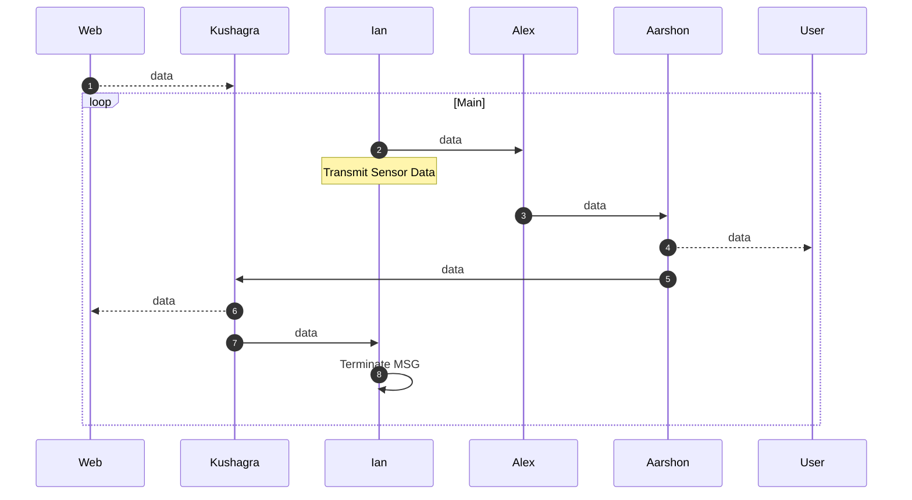

## Block Diagram

## Process Diagram

``` mermaid
sequenceDiagram
    autonumber
    Web-->>Kushagra: data
    loop Main
        Ian->>Alex: data
        Note over Ian: Transmit Sensor Data
        Alex->>Aarshon: data
        Aarshon-->>User: data
        Aarshon->>Kushagra: data
        Kushagra-->>Web: data
        Kushagra->>Ian: data
        Ian->>Ian: Terminate MSG
    end
```

## Message Structure

Message type bytes 1-2 uint16_t | Description
---|---
1 | smth
2 | *cont.*

Message Type: 1

bytes 1-2 | byte 3
---|---
0x01 | more
