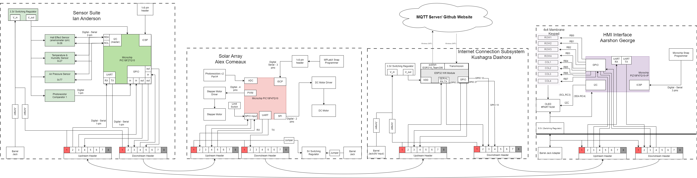

## Block Diagram

The station is comprised of four subsystems which are each assigned to a group member. These subsystems are connected through a UART daisy chain that functions as a continuous loop for messages. This daisy chain is also used to transfer power, ground, and other signals between neighboring subsystems.

Daisy Chain Header Pin Assignment  

1. External Power (+9-12V)
2. UART Transmit Line (TX/RX)
3. UART Ready to Send (inactive)
4. UART Clear to Send (inactive)
5. Subsystem Specific/No Connection
6. Subsystem Specific/No Connection
7. Subsystem Specific/No Connection
8. External Ground

## Process Diagram

All critical information is sent through UART and must follow the protocol below. Messages that are sent to everyone in the chain are trashed by the sender. Messages with a designated recipient are trashed by the recipient. Messages may be single commands or continuous loops.  
Relevant message data is differentiated by utilizing the recipient ID and message type bytes. Certain message types are relevant to all subsystems. Messages that don't pertain to the subsystem are passed along down the chain.

## Message Structure

All important communication between subsystems is done over the UART daisy chain. UART messages all follow the same message structure which uses up to 64 bytes. This structure is started by two start bytes, followed by the sender ID byte and the recipient ID byte. The message information is held in the following bytes and can be up to 58 bytes in length. The message is terminated with two stop bytes.  
If any of the 4 prefix bytes are corrupted, the message is rejected. Messages are terminated after 64 bytes to stop an open loop upon failure to receive either of the two stop bytes.

0    | 1    | 2       | 3          | 4 - 61  | 62   | 63
-----|------|---------|------------|---------|------|---
`0x41` | `0x5A` | Send ID | Receive ID | Message | `0x59` | `0x42`

Team Member      | Subsystem ID
-----------------|--------------
Broadcast        | `0x58 'X'`
Aarshon George   | `0x61 'a'`
Alex Comeaux     | `0x63 'c'`
Ian Anderson     | `0x69 'i'`
Kushagra Dashora | `0x6B 'k'`

The following defines the various messages and their structures to be sent within the UART message protocol. The first message byte is used to identify the type of message, and the following 57 bytes contain the data.

Message type byte[5] (`uint8_t`) | Description
---------|---------------------------
1 `0x49` | print sensor X data Y
2 `0x50` | move motor X param Y
3 `0x51` | set period X
4 `0x52` | subsystem status code X
5 `0x53` | subsystem Z error msg
6 `0x54` | print local weather X data Y

**Message Type 1:** Sensor Data Transmission  
Message type for sending measured wind speed, temperature, humidity, and air pressure to all other subsystems.

byte 1 | byte 2        | byte 3-4
-------|---------------|------------
`0x49` | X(`uint8_t`)  | Y(`uint16_t`)
~      | sensor number | data value

Number Code | Sensor
------------|------
`0x49`      | wind speed
`0x50`      | temperature
`0x51`      | humidity
`0x52`      | atm pressure

**Message Type 2:** Shift Motor  
Message type for sending a command to rotate base stepper "Y" degrees.

byte 1 | byte 2       | byte 3
-------|--------------|---
`0x50` | X(`uint8_t`) | Y(`uint8_t`)
~      | motor #      | theta

**Message Type 3:** Alignment frequency  
Message type for sending a command to set the panel alignment frequency "X" number of seconds.

byte 1 | byte 2-3
-------|-----------
`0x51` | X(`uint16_t`)
~      | time(sec)

**Message Type 4:** Subsystem Status Code  
Message type for sending status code of a subsystem to be displayed. Sender ID is used to determine affected subsystem.

byte 1 | byte 2
-------|-----------
`0x52` | X(`uint8_t`)
~      | error code

code number | meaning
------------|----------------
0 `0x49`    | full funtionality
1 `0x50`    | partial funtionality
2 `0x51`    | no funtionality

**Message Type 5:** Subsystem Error Message  
Message type for sending string about subsystem error. Sender ID is used to determine affected subsystem.

byte 1 | byte 2-58
-------|----------------------------
`0x53` | Error Message char(`uint8_t`)

**Message Type 6:** Local Weather Data  
Message type for sending received local weather data for HMI display

Byte 1 | Byte 2       | Byte 3-4
-------|--------------|------------
`0x54` | X(`uint8_t`) | Y(`uint16_t`)
~      | data type    | data value

Number Code | Data
------------|------
1 `0x49`    | wind speed
2 `0x50`    | temperature
3 `0x51`    | humidity
4 `0x52`    | atm pressure
