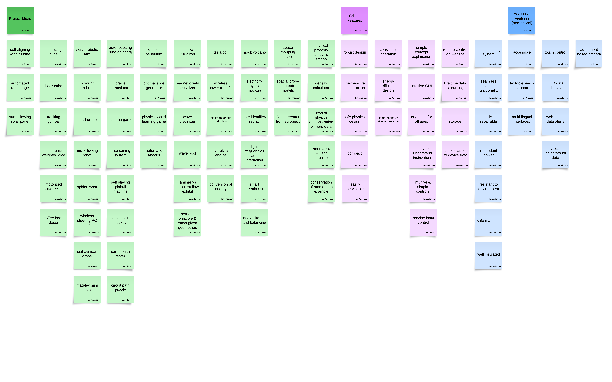

## Raw Idea Generation

We immediately followed with meeting to discuss possible ideas and criteria. Every idea was then thrown up on a board for easier organization. Below is the unsorted ideas that were created by the team.

## Sorted & Grouped Ideas

This was then followed with organizing all of the ideas into three main catagories. The first catagory, depicted in green, is all of the various project ideas that we produced. The magenta notes are critical features or criteria that need to be achieved. The other features shown in blue are not necessary to the final project but would be interesting additions if possible. These groups were then further organized by similarity into columns. We then combined various subgroups to arrive at our concept.

## Our Concept

The Smart STEM Weather Station is designed to captivate and educate museum visitors by providing real-time environmental data through an interactive interface. This design prioritizes accessibility and engagement, addressing visitor needs with features that make learning both hands-on and straightforward. For example, the station's LCD screen and physical buttons create an easy-to-navigate system suitable for all ages. Additional features like color-coded LED indicators and user-friendly alerts simplify the interpretation of complex data. The station will also include instructional elements such as on-screen prompts, and demonstrations illustrating how the sensors work to collect data.

The functionality of the weather station is divided among four team members, each contributing to an individual subsystem. One teammate will handle internet-based two-way communication using the ESP32 microcontroller, enabling data retrieval and updates from an API that stores local weather data. Another will design the human-machine interface (HMI), developing the interactive LCD display and control buttons for navigating the data and controlling the system. The third teammate will focus on the sensor subsystem, integrating temperature, humidity, ultraviolet, air pressure, air quality, and wind speed sensors to collect real-time environmental data for the purposes of demonstration. The fourth member will manage the actuator-based response, implementing a solar array that tracks sunlight using the acquired weather data.

To ensure ease of use, the weather station uses visual cues, such as LED status indicators, and a simplified graphical interface on a 16x2 LCD screen. Guided by the "Suggested Guidelines for Designing Interactive Exhibits," the controls are ergonomically designed with large, easy-to-use buttons and an interface that avoids complexity. Durability, safety, and comfort are central to the design—each subsystem is weatherproofed, with sturdy enclosures to withstand environmental challenges like rain, wind, and mild debris. Safety features include automatic shutoff and several fuses to prevent overheating and protect against power surges.

## Goal of the Exhibit

The Smart STEM Weather Station exhibit's main objective is to create an entertaining and instructive experience that encourages curiosity and an awareness of environmental science. The exhibit was created with accessibility and engagement to make difficult scientific ideas understandable to a wide range of viewers. Visitors are urged to actively investigate weather patterns and environmental elements by integrating real-time data collecting with an easy-to-use interface, transforming abstract data into concrete, significant discoveries. An LCD display, tactile buttons, and sensor demonstrations are examples of hands-on features that guarantee visitors will not only view the exhibit but also engage with it and gain knowledge from it. This adheres to the "Suggested Guidelines for Designing Interactive Exhibits" by emphasizing clarity, simplicity, and an active learning strategy to maintain visitor interest and enhance educational outcomes.

## Target Audience

The exhibit is designed to appeal to a wide range of visitors, including those of all ages, but it focuses especially on K–12 pupils. Its user-friendly design will appeal to younger audiences since it incorporates visual signals like LED indicators, big buttons, and guided directions to make navigation and data interpretation easier. Deeper levels of exploration, such as comprehending how sensors gather data and identifying patterns in environmental changes, are available for older kids and adults in the exhibit. The Smart STEM Weather Station guarantees inclusivity and accessibility by accommodating a variety of learning styles and educational levels. Following the "Suggested Guidelines for Designing Interactive Exhibits," the display also strongly emphasizes making an experience that is cozy, captivating, and long-lasting to draw in visitors, pique their interest, and enable them to learn in a meaningful way.

Core Functionalities (Sensors):
The system integrates four key sensors to provide comprehensive environmental monitoring:

1. Temperature & Humidity Sensor
a. Measures atmospheric temperature and humidity.
b.Provides real-time data for tracking weather trends and indoor/outdoor climate conditions.

1. Air Pressure Sensor
a. Tracks atmospheric pressure changes to help predict weather patterns.
b. Useful for understanding high and low-pressure systems.

1. Wind Speed Sensor
a. Measures wind velocity and direction to analyze weather trends.
b. Provides insights into wind patterns and their impact on daily weather.

1. Air Quality Sensor
a. Detects pollutants such as CO2, VOCs, and particulate matter.
b. Helps students understand environmental health and pollution levels.

The Smart STEM Weather Station is an innovative and engaging educational tool that brings real-world weather monitoring into the classroom. By combining real-time data collection, interactive learning, and cloud-based connectivity, it provides students with an immersive STEM experience. Designed with durability, accessibility, and ease of use in mind, this weather station aims to inspire curiosity and enhance learning opportunities for students of all ages.
