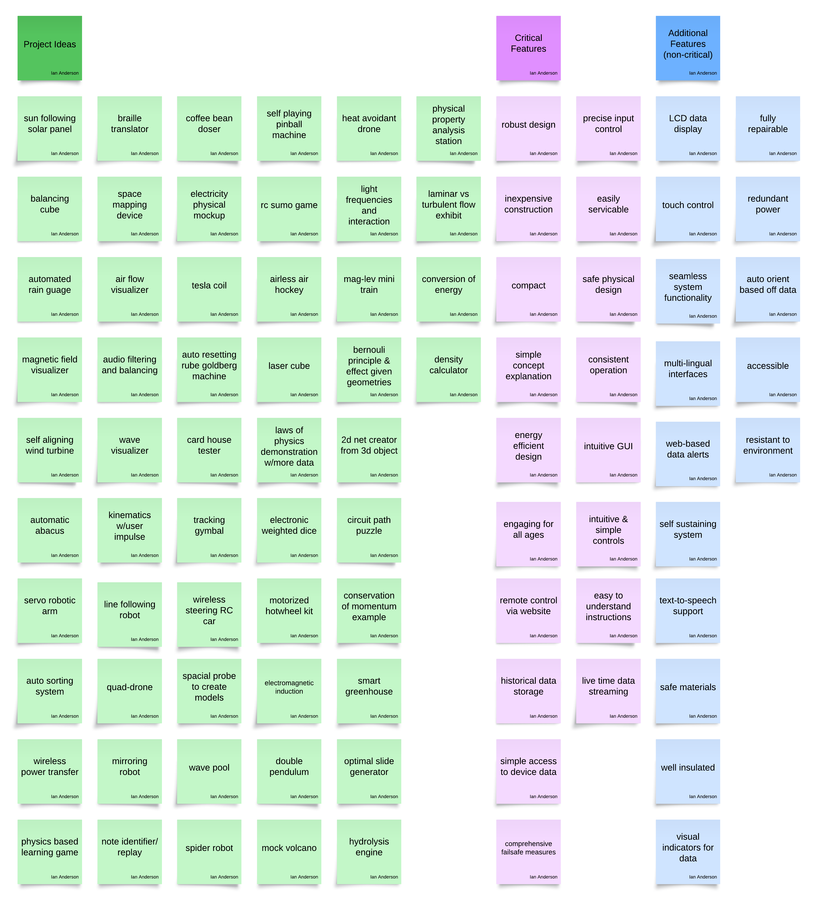

## Goal of the Exhibit

The Smart STEM Weather Station exhibit's main objective is to create an entertaining and instructive experience that encourages curiosity and an awareness of environmental science. The exhibit was created with accessibility and engagement to make difficult scientific ideas understandable to a wide range of viewers. Visitors are urged to actively investigate weather patterns and environmental elements by integrating real-time data collecting with an easy-to-use interface, transforming abstract data into concrete, significant discoveries. An LCD display, tactile buttons, and sensor demonstrations are examples of hands-on features that guarantee visitors will not only view the exhibit but also engage with it and gain knowledge from it. This adheres to the "Suggested Guidelines for Designing Interactive Exhibits" by emphasizing clarity, simplicity, and an active learning strategy to maintain visitor interest and enhance educational outcomes.

## Target Audience

The exhibit is designed to appeal to a wide range of visitors, including those of all ages, but it focuses especially on K–12 pupils. Its user-friendly design will appeal to younger audiences since it incorporates visual signals like LED indicators, big buttons, and guided directions to make navigation and data interpretation easier. Deeper levels of exploration, such as comprehending how sensors gather data and identifying patterns in environmental changes, are available for older kids and adults in the exhibit. The Smart STEM Weather Station guarantees inclusivity and accessibility by accommodating a variety of learning styles and educational levels. Following the "Suggested Guidelines for Designing Interactive Exhibits," the display also strongly emphasizes making an experience that is cozy, captivating, and long-lasting to draw in visitors, pique their interest, and enable them to learn in a meaningful way.

## Concept & Design Generation

### Ideation

We met together to discuss possible ideas and design criteria. Every idea was accepted to broaden our options. Each idea was given its own note and was place on the below board. Design Brainstorming: At the project’s outset, the team engaged in extensive brainstorming to generate a wide range of exhibit ideas and features. All ideas were recorded on notes and grouped by themes such as potential exhibit concepts, critical features, and “nice-to-have” additions

We considered various STEM demonstration concepts before converging on a weather station with a solar energy component. Key criteria that guided our concept selection were educational value, interactivity, feasibility, and coherence with the STEM theme. By sorting and combining subgroups of ideas, we arrived at the integrated concept of the Smart Weather Station – a hybrid exhibit showcasing both environmental sensing and renewable energy harvesting.This concept merged our strongest ideas: real-time weather data display, a solar panel that reacts to environmental conditions, and internet connectivity for broader engagement.

### Sorting & Grouping Ideas

These ideas were then organized into three main categories. The first catagory, depicted in green, is all of the various exhibit ideas that we produced. The magenta notes are critical features or criteria that need to be achieved. The other features shown in blue are not necessary to the final exhibit but could be interesting additions if possible. These groups were then further organized by similarity into columns. We then combined various subgroups to arrive at our concept.

## Our Concept

### Concept Description

The Smart STEM Weather Station is designed to captivate and educate museum visitors by providing real-time environmental data through an interactive interface. This design prioritizes accessibility and engagement, addressing visitor needs with features that make learning both hands-on and straightforward. For example, the station's LCD screen and physical buttons create an easy-to-navigate system suitable for all ages. Additional features like color-coded LED indicators and user-friendly alerts simplify the interpretation of complex data. The station will also include instructional elements such as on-screen prompts, and demonstrations illustrating how the sensors work to collect data.

### Planned Workflow

The functionality of the weather station is divided among four team members, each contributing to an individual subsystem. One teammate will handle internet-based two-way communication using the ESP32 microcontroller, enabling data retrieval and updates from an API that stores local weather data. Another will design the human-machine interface (HMI), developing the interactive LCD display and control buttons for navigating the data and controlling the system. The third teammate will focus on the sensor subsystem, integrating temperature, humidity, ultraviolet, air pressure, air quality, and wind speed sensors to collect real-time environmental data for the purposes of demonstration. The fourth member will manage the actuator-based response, implementing a solar array that tracks sunlight using the acquired weather data.

To ensure ease of use, the weather station uses visual cues, such as LED status indicators, and a simplified graphical interface on a 16x2 LCD screen. Guided by the "Suggested Guidelines for Designing Interactive Exhibits," the controls are ergonomically designed with large, easy-to-use buttons and an interface that avoids complexity. Durability, safety, and comfort are central to the design—each subsystem is weatherproofed, with sturdy enclosures to withstand environmental challenges like rain, wind, and mild debris. Safety features include automatic shutoff and several fuses to prevent overheating and protect against power surges.

## Final Concept Selection:

**Final Concept :** The chosen concept emphasizes an **interactive weather station** that not only measures weather parameters but also dynamically responds (via the solar panel tracker). We selected this design because it met multiple goals: it engages users with live data, includes a visually interesting movement (the panel tracking the “sun”), and teaches multiple STEM topics in one exhibit. The final decision was reached by consensus after evaluating which idea best satisfied our mission statement and the project requirements. We found that the weather station concept could incorporate most of the team’s ideas (sensors, displays, moving parts, connectivity) in a cohesive way, rather than building separate exhibits for each idea.

Evolution from Initial Ideas: There were a few deviations between our early concept and the final implementation. Initially, the concept description imagined features like an LCD screen with big buttons, LED indicators, and possibly additional sensors (e.g., ultraviolet index, air quality) for comprehensive coverage.

In practice, we refined the scope to ensure reliability and clarity. For example, we replaced the simple 16×2 text LCD with a higher-resolution 128×64 OLED display for a more versatile and engaging interface (allowing graphics and better readability)

Some envisioned sensors (such as UV and air quality) were not included in the final build due to time and budget constraints; instead we focused on core sensors (temperature, humidity, pressure, wind) that provide plenty of learning opportunities.

The idea of retrieving local weather data from an online API for comparison was discussed early on, but the final design prioritized live data from our own sensors to keep the experience authentic and self-contained. Additionally, our approach to solar tracking shifted from possibly using external data or complex logic to a simpler, robust method: two photoresistors and a hardware comparator now determine the sun’s direction, which directly drives the panel alignment mechanism. 

These adjustments ensured that the final implementation remained achievable and dependable while still fulfilling the spirit of our original concept. In summary, the ideation process yielded a strong concept which we honed to balance ambition with practicality, resulting in a successful final design.

## Concept Presentation

<iframe width="902" height="516" src="https://www.youtube.com/embed/3_g23dJBYLU" title="" frameborder="0" allow="accelerometer; autoplay; clipboard-write; encrypted-media; gyroscope; picture-in-picture; web-share" referrerpolicy="strict-origin-when-cross-origin" allowfullscreen></iframe>
