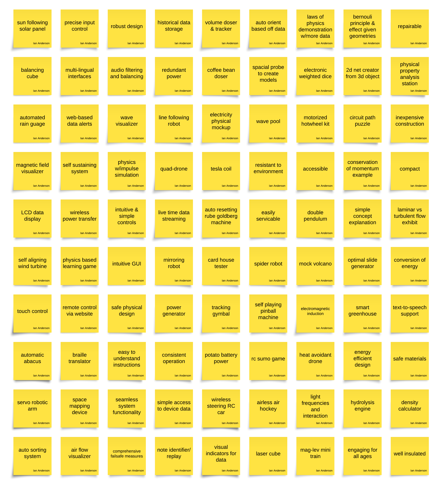

### Raw Idea Generation

We immediately followed with meeting to discuss possible ideas and criteria. Every idea was then thrown up on a board for easier organization. Below is the unsorted ideas that were created by the team.

## Sorted & Grouped Ideas

## Concept Sketch

*sketch description*
