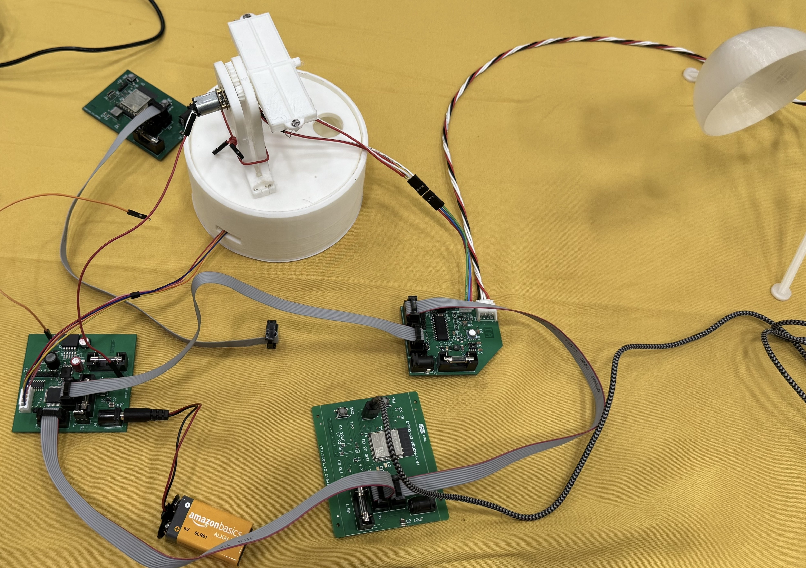
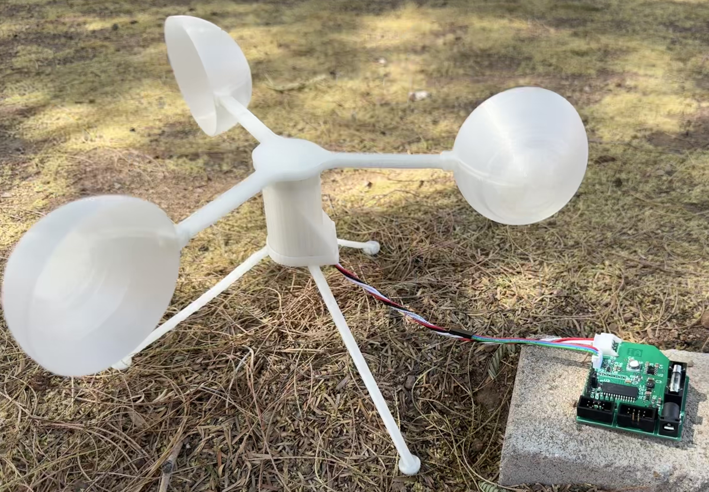

## Final Project Media

**Final Assembly**  
  

**Project Poster**  

**Demo Video: Preliminary Presenation**  
<iframe width="560" height="315" src="https://www.youtube.com/embed/1kG3tjDgoXE?si=4WEde_MOiY4Au47Y" title="YouTube video player" frameborder="0" allow="accelerometer; autoplay; clipboard-write; encrypted-media; gyroscope; picture-in-picture; web-share" referrerpolicy="strict-origin-when-cross-origin" allowfullscreen></iframe>

**Team Photo**  

## Project Files

### Code

- [Sensor Subsystem](./assets/code/Ian_Anderson_Sensor_Suite_code.zip)
- [Actuator Subsystem](./assets/code/314_AlexC_ActuatorCode.zip)
- [MQTT Subsystem](./assets/code/KD_Subsystem_Code.zip)
- [HMI Subsystem](./assets/code/HMI-GUI-Python.rar)

### eCAD

- [Sensor Subsystem](./assets/eCAD/EGR314_Ian_Subsytem.zip)
- [Actuator Subsystem](./assets/eCAD/314_AlexC_PCB.zip)
- [MQTT Subsystem](./assets/eCAD/EGR314_KD_Subsystem.zip)
- [HMI Subsystem](./assets/eCAD/EGR314_Aarshon_IndividualSub-3.0.zip)

### mCAD

- [Sensor Subsystem](./assets/mCAD/Ian_Anderson_anemometer_mCAD.zip)
- [Actuator Subsystem](./assets/mCAD/SolarArrayAssembly.zip)

***By making these resources available, we hope to encourage further learning and possibly inspire future projects.***
